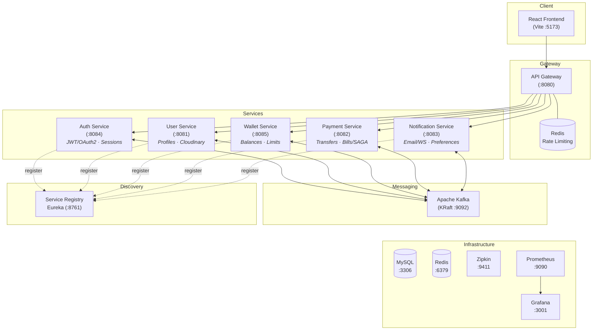

# FinPay Platform

A production-grade digital wallet and payments platform built on an event-driven microservices architecture. FinPay handles peer-to-peer transfers, bill payments, payment requests, multi-tier subscription plans, and real-time notifications - all backed by distributed SAGA transactions with automatic compensation.

---

## Architecture



---

## Services

| Service | Port | Responsibility |
|---------|------|----------------|
| **Service Registry** | 8761 | Eureka-based service discovery and health monitoring |
| **API Gateway** | 8080 | Request routing, JWT extraction, rate limiting, admin auth enforcement |
| **Auth Service** | 8084 | Registration, login, JWT/refresh tokens, OAuth2 (Google & GitHub), plan upgrades |
| **User Service** | 8081 | User profiles, Cloudinary image uploads, admin user management, audit logging |
| **Wallet Service** | 8085 | Wallet balances, fund reservation/deduction/credit, spend tracking, transaction limits |
| **Payment Service** | 8082 | P2P transfers, bill payments, money requests - all orchestrated via distributed SAGAs |
| **Notification Service** | 8083 | Email delivery (Thymeleaf templates), WebSocket push, in-app notifications, preferences |
| **Frontend** | 5173 | React SPA with dashboard, admin panel, real-time updates |

---

## Technology Stack

### Backend
| Layer | Technology |
|-------|-----------|
| Framework | Spring Boot 4.0.2, Spring Cloud 2025.1.0 |
| Language | Java 25 |
| Database | MySQL 8.0 (database-per-service) |
| Messaging | Apache Kafka (KRaft mode, no Zookeeper) |
| Caching | Redis 7 (sessions, rate limiting, idempotency, analytics) |
| Auth | JWT (JJWT 0.12.6), OAuth2 (Google, GitHub), BCrypt, HTTP-only cookies |
| API Docs | SpringDoc OpenAPI 2.8.6, aggregated at the gateway |
| Resilience | Resilience4j circuit breakers, Spring Retry with exponential backoff |
| Mapping | MapStruct 1.6.3, Lombok |
| Tracing | OpenTelemetry + Zipkin (100% sampling) |
| Metrics | Micrometer → Prometheus → Grafana |
| Email | Spring Mail + Thymeleaf HTML templates |
| Image Upload | Cloudinary 2.0.0 |
| Testing | JUnit 5, Testcontainers 2.0.0 (MySQL, Kafka, Redis) |

### Frontend
| Layer | Technology |
|-------|-----------|
| Framework | React 19, TypeScript 5.7, Vite 6.1 |
| Styling | Tailwind CSS 3.4 with custom design system (glassmorphism, gradients, animations) |
| State | TanStack Query 5.x (server state), React Context (auth) |
| Routing | React Router 7 with lazy-loaded code splitting |
| Real-time | STOMP over WebSocket (@stomp/stompjs) |
| HTTP | Axios with automatic token refresh interceptors |
| Icons | Lucide React |
| Animations | Framer Motion |
| Tables | TanStack Table |
| Exports | jsPDF + jspdf-autotable for PDF generation |
| Testing | Vitest + React Testing Library + MSW (API mocking) |
| E2E | Playwright (Chromium) |

---

## Key Features

### Payments & Transfers
- **Peer-to-Peer Transfers** - send money to any user with real-time recipient search and instant balance updates
- **Bill Payments** - pay utilities (electricity, water, gas, internet, phone, insurance, education, healthcare) from 17 pre-configured billers with category filtering
- **Money Requests** - request payments from other users with approve/decline/cancel workflow and automatic expiration
- **Transaction History** - paginated, filterable history with status timeline visualization and receipt details

### Wallet
- **Digital Wallet** - auto-created on registration with configurable currency
- **Fund Operations** - deposit, withdraw, reserve, release, deduct, credit, reverse
- **Spend Tracking** - daily and monthly spend limits with automatic calendar-based resets
- **Plan-Based Limits** - transaction limits and feature flags scale with subscription tier
- **Optimistic Locking** - `@Version` on wallet entity prevents concurrent modification conflicts
- **Freeze/Unfreeze** - administrative control over wallet access

### Authentication & Security
- **JWT Authentication** - access tokens (15 min) + refresh tokens (7 days) stored in HTTP-only secure cookies
- **OAuth2 Social Login** - Google and GitHub with automatic account creation
- **Token Blocklist** - Redis-backed revocation with TTL matching token expiry
- **Session Caching** - user sessions cached in Redis to reduce database load
- **Rate Limiting** - Redis-backed sliding window at the gateway (20 req/min auth, 200 req/min admin, 100 req/sec general)
- **Admin Route Protection** - JWT claims parsed at gateway; `X-User-Id`, `X-User-Role`, `X-User-Email` headers injected downstream

### Subscription Plans
| Feature | Starter (Free) | Pro ($29/mo) | Enterprise (Custom) |
|---------|:-:|:-:|:-:|
| Daily Transaction Limit | Base | Higher | Custom |
| Monthly Transaction Limit | Base | Higher | Custom |
| Virtual Cards | 1 | Multiple | Unlimited |
| Multi-Currency | - | ✓ | ✓ |
| API Access | - | - | ✓ |

### Notifications
- **Multi-Channel** - email (SMTP + Thymeleaf templates), SMS, push, in-app
- **Real-Time** - WebSocket STOMP push to connected clients with automatic TanStack Query cache invalidation
- **Preferences** - per-channel and per-type toggles (payment, security, promotional, system)
- **Notification Types** - registration, verification, transfers (sent/received), bill payments, money requests, plan upgrades, security alerts

### Admin Dashboard
- **User Management** - search, filter, role changes (USER/ADMIN/MERCHANT), suspend/unsuspend, force password reset
- **Transaction Monitoring** - unified view of transfers, bill payments, and money requests with filtering and KPI metrics
- **Wallet Management** - view all wallets, freeze/unfreeze accounts, analytics
- **Audit Logging** - PCI-DSS/SOX compliant audit trail with actor, action, target, state diffs, IP address, and service source
- **System Overview** - health metrics across all services
- **Notification Broadcasts** - send system-wide notifications

### Frontend Experience
- **Responsive Design** - mobile-first with glassmorphism cards, gradient accents, smooth Framer Motion animations
- **Multi-Step Registration** - plan selection → account details with real-time password strength validation
- **Smart Polling** - conditional query refetching only while transactions are in PROCESSING/PENDING state
- **Optimistic Updates** - instant UI feedback on mark-as-read, balance changes, with automatic rollback on failure
- **PDF Export** - generate downloadable reports from admin tables
- **Lazy Loading** - route-level code splitting with Vite manual chunks (vendor-react, vendor-motion, vendor-query)
- **Public Pages** - pricing, about, contact, docs, blog, careers, privacy policy, terms of service, cookie policy, compliance

---

## Distributed Architecture Patterns

### Transactional Outbox
Every service uses a shared `finpay-outbox-starter` library that persists Kafka events to an `outbox_events` table within the same database transaction as the business operation. A background poller publishes pending events to Kafka with retry logic and exponential backoff - guaranteeing at-least-once delivery without two-phase commits.

### SAGA Orchestration
The Payment Service acts as the SAGA orchestrator for all financial flows:

```
Money Transfer SAGA:
  INITIATE → RESERVE funds → DEDUCT from sender → CREDIT to recipient → NOTIFY → COMPLETE

Compensation (on failure at any step):
  COMPENSATING → reverse credits → release reserves → COMPENSATED
```

Each SAGA entity (`MoneyTransfer`, `BillPayment`, `MoneyRequest`) tracks individual step completion flags (`fundsReserved`, `fundsDeducted`, `fundsCredited`, `notificationSent`) and compensation state for reliable rollback.

### Idempotent Consumer
The outbox starter includes an `IdempotentConsumerService` backed by a `processed_events` table and optional Redis acceleration. Every consumed Kafka event is checked for duplicate `eventId` before processing - preventing double-execution in at-least-once delivery scenarios.

### Circuit Breaker
Inter-service REST calls (e.g., auth-service → user-service) are wrapped with Resilience4j circuit breakers: sliding window of 10 requests, 50% failure threshold, 30-second wait in open state, 3 permitted calls in half-open.

---

## Event-Driven Messaging

### Kafka Topics

| Topic | Producer | Consumer(s) | Purpose |
|-------|----------|-------------|---------|
| `auth-events` | Auth Service | User Service | User registration sync, plan upgrades |
| `user-events` | User Service | Auth, Wallet, Notification | User profile changes, status updates |
| `wallet-commands` | Payment Service | Wallet Service | SAGA commands (reserve, deduct, credit) |
| `wallet-responses` | Wallet Service | Payment Service | SAGA confirmations |
| `transfer-saga-events` | Payment Service | Wallet, Notification | P2P transfer orchestration |
| `transfer-notification-topic` | Payment Service | Notification Service | Transfer completion alerts |
| `bill-payment-events` | Payment Service | Notification Service | Bill payment status changes |
| `money-request-events` | Payment Service | Notification Service | Money request notifications |
| `payment-events` | Payment Service | Notification Service | General payment lifecycle |
| `preference-events` | Notification Service | - | Preference change broadcasts |

All topics use 3 partitions. Each service has its own consumer group for independent offset tracking.

---

## Database Design

Five isolated databases following the database-per-service pattern:

| Database | Service | Key Tables |
|----------|---------|------------|
| `finpay_auth` | Auth Service | `user_credentials`, `refresh_tokens`, `outbox_events` |
| `finpay_users` | User Service | `users`, `audit_logs`, `outbox_events` |
| `finpay_wallets` | Wallet Service | `wallets` (with embedded `spend_tracker`), `wallet_transactions`, `outbox_events` |
| `finpay_payments` | Payment Service | `payments`, `money_transfers`, `bill_payments`, `money_requests`, `payment_methods`, `outbox_events` |
| `finpay_notifications` | Notification Service | `notifications`, `notification_preferences`, `outbox_events` |

All services share the `outbox_events` and `processed_events` table schemas for transactional outbox and idempotent consumer patterns.

Audit logs include indexes optimized for PCI-DSS/SOX compliance queries: by actor, target, action, timestamp, and composite actor+action.

---

## REST API Reference

### Auth Service - `/api/v1/auth`
| Method | Endpoint | Description |
|--------|----------|-------------|
| POST | `/register` | Register with email, password, and plan selection |
| POST | `/login` | Authenticate and receive JWT tokens in HTTP-only cookies |
| POST | `/refresh` | Rotate refresh token |
| POST | `/logout` | Revoke current session |
| POST | `/logout-all` | Revoke all sessions across devices |
| GET | `/me` | Get current user profile (enriched from user-service) |
| PUT | `/plan` | Upgrade subscription plan |
| GET | `/oauth2/authorization/{google\|github}` | Initiate OAuth2 flow |

### User Service - `/api/v1/users`
| Method | Endpoint | Description |
|--------|----------|-------------|
| GET | `/{id}` | Get user by ID |
| GET | `/email/{email}` | Get user by email |
| GET | `/search?query=&excludeUserId=` | Paginated user search (for recipient lookup) |
| PUT | `/{id}` | Update profile |
| DELETE | `/{id}` | Delete user |
| PATCH | `/{id}/status` | Change user status |
| POST | `/{id}/verify-email` | Mark email as verified |
| POST | `/{id}/profile-image` | Upload profile image (multipart, max 5MB) |
| DELETE | `/{id}/profile-image` | Remove profile image |

### Wallet Service - `/api/v1/wallets`
| Method | Endpoint | Description |
|--------|----------|-------------|
| GET | `/user/{userId}` | Get wallet with balance, limits, and spend tracker |
| POST | `/deposit` | Deposit funds |
| POST | `/withdraw` | Withdraw funds |
| POST | `/reserve` | Reserve funds (SAGA step) |
| POST | `/release` | Release reserved funds |
| POST | `/deduct` | Deduct reserved funds (SAGA step) |
| POST | `/credit` | Credit funds (SAGA step) |
| POST | `/reverse-credit` | Reverse a credit (compensation) |
| POST | `/reverse-deduction` | Reverse a deduction (compensation) |
| POST | `/user/{userId}/freeze` | Freeze wallet |
| POST | `/user/{userId}/unfreeze` | Unfreeze wallet |
| GET | `/user/{userId}/transactions` | Paginated transaction history |
| GET | `/user/{userId}/transactions/recent` | Latest N transactions |
| GET | `/transactions/reference/{ref}` | Transactions by reference ID |

### Payment Service - `/api/v1/payments`

**Transfers** - `/api/v1/payments/transfers`
| Method | Endpoint | Description |
|--------|----------|-------------|
| POST | `/` | Initiate P2P transfer (starts SAGA) |
| GET | `/{id}` | Get transfer details |
| GET | `/reference/{ref}` | Get by transaction reference |
| GET | `/user/{userId}` | Paginated transfer history |

**Bill Payments** - `/api/v1/payments/bills`
| Method | Endpoint | Description |
|--------|----------|-------------|
| POST | `/` | Pay a bill (starts SAGA) |
| GET | `/{id}` | Get bill payment details |
| GET | `/user/{userId}` | Paginated bill payment history |
| GET | `/user/{userId}/category/{cat}` | Filter by category |
| POST | `/{id}/cancel` | Cancel pending bill payment |
| GET | `/categories` | List available bill categories |

**Money Requests** - `/api/v1/payments/requests`
| Method | Endpoint | Description |
|--------|----------|-------------|
| POST | `/` | Create a payment request |
| POST | `/{id}/approve` | Approve and trigger SAGA |
| POST | `/{id}/decline` | Decline request |
| POST | `/{id}/cancel` | Cancel own request |
| GET | `/pending/incoming` | Pending requests awaiting your approval |
| GET | `/pending/outgoing` | Your pending outgoing requests |
| GET | `/pending/count` | Count of pending requests (for badge) |

### Notification Service - `/api/v1/notifications`
| Method | Endpoint | Description |
|--------|----------|-------------|
| GET | `/user/{userId}` | All notifications |
| GET | `/user/{userId}/paged` | Paginated with sorting |
| GET | `/user/{userId}/unread` | Unread notifications |
| GET | `/user/{userId}/unread/count` | Unread count |
| POST | `/{id}/read` | Mark single as read |
| POST | `/user/{userId}/read-all` | Mark all as read |
| DELETE | `/{id}` | Delete notification |
| GET | `/user/{userId}/preferences` | Get notification preferences |
| PUT | `/user/{userId}/preferences` | Update preferences |

### Admin Endpoints - `/api/v1/admin`
| Method | Endpoint | Description |
|--------|----------|-------------|
| GET | `/users` | List users with search, status, role filters |
| GET | `/users/{id}` | Get user detail |
| PATCH | `/users/{id}/role` | Change user role |
| POST | `/users/{id}/suspend` | Suspend user |
| POST | `/users/{id}/unsuspend` | Unsuspend user |
| GET | `/users/dashboard/metrics` | Dashboard KPI metrics |
| GET | `/transactions` | All transactions (type, status filters) |
| GET | `/transactions/metrics` | Transaction analytics |
| GET | `/wallets` | All wallets with filters |
| GET | `/wallets/metrics` | Wallet analytics |
| GET | `/audit-logs` | Audit log with comprehensive filters |

### API Documentation
Swagger UI is aggregated at the gateway: `http://localhost:8080/swagger-ui.html`

Individual service docs are available at `/v3/api-docs` on each service port.

---

## Prerequisites

- Java 25+
- Maven 3.9+
- Docker & Docker Compose
- Node.js 20+ (for frontend)

## Getting Started

### 1. Start Infrastructure

```bash
docker-compose up -d
```

This brings up MySQL, Kafka (KRaft), Redis, Zipkin, Prometheus, and Grafana with pre-configured dashboards.

### 2. Configure Environment

Create `backend/.env` with your credentials:

```env
# Database
MYSQL_USERNAME=finpay
MYSQL_PASSWORD=finpay123

# Kafka
KAFKA_BOOTSTRAP_SERVERS=localhost:9092

# Redis
REDIS_HOST=localhost
REDIS_PORT=6379

# JWT
JWT_SECRET=your-256-bit-secret-key
JWT_EXPIRATION=900000
JWT_REFRESH_EXPIRATION=604800000

# OAuth2
GOOGLE_CLIENT_ID=your-google-client-id
GOOGLE_CLIENT_SECRET=your-google-client-secret
GITHUB_CLIENT_ID=your-github-client-id
GITHUB_CLIENT_SECRET=your-github-client-secret
OAUTH2_REDIRECT_URI=http://localhost:5173/oauth2/callback

# Cookies
COOKIE_DOMAIN=localhost
COOKIE_SECURE=false
COOKIE_SAME_SITE=Strict

# Cloudinary (User Service)
CLOUDINARY_CLOUD_NAME=your-cloud-name
CLOUDINARY_API_KEY=your-api-key
CLOUDINARY_API_SECRET=your-api-secret

# Email (Notification Service)
MAIL_HOST=smtp.gmail.com
MAIL_PORT=587
MAIL_USERNAME=your-email@gmail.com
MAIL_PASSWORD=your-app-password
MAIL_FROM=noreply@finpay.com
MAIL_ENABLED=true

# Tracing
ZIPKIN_ENDPOINT=http://localhost:9411/api/v2/spans
```

### 3. Start Backend Services

Start in this order:

```bash
# Service Registry (must be first)
cd backend/service-registry && mvn spring-boot:run

# API Gateway
cd backend/api-gateway && mvn spring-boot:run

# Auth Service
cd backend/auth-service && mvn spring-boot:run

# User Service
cd backend/user-service && mvn spring-boot:run

# Wallet Service
cd backend/wallet-service && mvn spring-boot:run

# Payment Service
cd backend/payment-service && mvn spring-boot:run

# Notification Service
cd backend/notification-service && mvn spring-boot:run
```

### 4. Start Frontend

```bash
cd frontend
npm install
npm run dev
```

The app will be available at `http://localhost:5173`.

---

## Build & Test

### Backend

```bash
# Build all modules
cd backend
mvn clean package

# Run tests (uses Testcontainers - requires Docker)
mvn test

# Build without tests
mvn clean package -DskipTests
```

### Frontend

```bash
cd frontend

# Unit & component tests
npm test

# Single test run
npm run test:run

# Coverage report
npm run test:coverage

# E2E tests (Playwright)
npm run test:e2e

# E2E with interactive UI
npm run test:e2e:ui

# Lint
npm run lint

# Type check
npm run type-check
```

---

## Docker

Each service has a multi-stage Dockerfile:
1. **Builder stage** - extracts Spring Boot layers from the fat JAR
2. **Runtime stage** - `eclipse-temurin:25-jre-alpine` with a non-root `finpay` user

```bash
# Start everything (infrastructure + services)
docker-compose up -d

# Rebuild service images
docker-compose up -d --build

# View logs
docker-compose logs -f payment-service

# Stop
docker-compose down
```

---

## Monitoring & Observability

| Tool | URL | Credentials | Purpose |
|------|-----|-------------|---------|
| Eureka Dashboard | http://localhost:8761 | - | Service registry, instance health |
| Swagger UI | http://localhost:8080/swagger-ui.html | - | Aggregated API documentation |
| Kafka UI | http://localhost:8090 | - | Topic inspection, consumer group lag |
| Zipkin | http://localhost:9411 | - | Distributed tracing, request correlation |
| Prometheus | http://localhost:9090 | - | Metrics collection, alerting queries |
| Grafana | http://localhost:3001 | admin / admin | Pre-provisioned dashboards for platform overview and endpoint tracing |

### Distributed Tracing
All services propagate trace context via OpenTelemetry. Logs include correlated trace and span IDs:
```
[payment-service, 6a3f8b2c1d4e5f00, 7b4c9d3e2f1a6b00]
```

### Prometheus Metrics
Every service exposes `/actuator/prometheus` with JVM metrics, HTTP request rates, Kafka consumer lag, database connection pools, and Redis connection stats. Prometheus scrapes all services at 10-second intervals.

### Grafana Dashboards
Two pre-provisioned dashboards:
- **FinPay Platform Overview** - service health, request rates, error rates, latencies
- **FinPay Tracing & Endpoints** - endpoint-level performance breakdown

---

## Project Structure

```
finpay-platform/
├── docker-compose.yml
├── docker/
│   ├── grafana/
│   │   ├── dashboards/                    # Pre-built Grafana dashboard JSON
│   │   └── provisioning/                  # Datasource & dashboard provisioning
│   ├── mysql/
│   │   └── init.sql                       # Database schemas, outbox tables, audit indexes
│   └── prometheus/
│       └── prometheus.yml                 # Scrape configs for all services
├── backend/
│   ├── pom.xml                            # Parent POM (dependency management)
│   ├── finpay-outbox-starter/             # Shared library: outbox pattern + idempotent consumer
│   ├── service-registry/                  # Netflix Eureka Server
│   ├── api-gateway/                       # Spring Cloud Gateway + rate limiting + auth filters
│   ├── auth-service/                      # JWT auth, OAuth2, token management
│   ├── user-service/                      # User profiles, Cloudinary, audit logs
│   ├── wallet-service/                    # Wallets, balances, spend tracking
│   ├── payment-service/                   # Transfers, bills, money requests, SAGA orchestration
│   └── notification-service/              # Email, WebSocket, preferences
└── frontend/
    ├── src/
    │   ├── api/                           # Typed API clients (auth, wallet, payment, admin, etc.)
    │   ├── components/
    │   │   ├── admin/                     # Admin layout, data tables, KPI cards
    │   │   ├── auth/                      # Protected routes, role guards
    │   │   ├── dashboard/                 # Wallet card, quick actions, recent transactions
    │   │   ├── home/                      # Landing page sections
    │   │   ├── layout/                    # Navbar, footer, scroll management
    │   │   ├── notifications/             # Bell, panel, toasts, WebSocket provider
    │   │   ├── payments/                  # Send money, request money, pay bills, transaction detail
    │   │   ├── register/                  # Multi-step registration flow
    │   │   └── settings/                  # Profile, plan/billing, notification preferences
    │   ├── contexts/                      # AuthContext, NotificationContext
    │   ├── hooks/                         # useWallet, useTransfer, useBillPayment, useMoneyRequest,
    │   │                                  # useNotifications, useWebSocket, useAdmin, useUpgradePlan, etc.
    │   ├── pages/                         # 25+ page components (dashboard, admin, public pages)
    │   ├── test/                          # Test setup, MSW handlers, factories, utilities
    │   └── utils/                         # Currency formatting, status colors, PDF export
    ├── e2e/                               # Playwright E2E tests
    └── package.json
```

---

## License

MIT License - see [LICENSE](LICENSE) for details.
